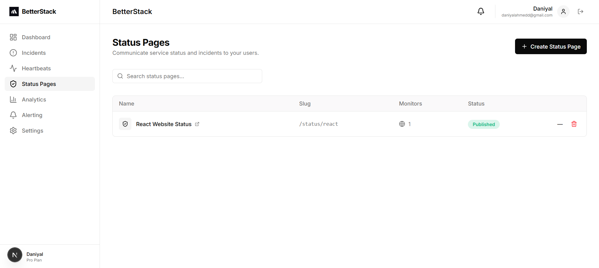
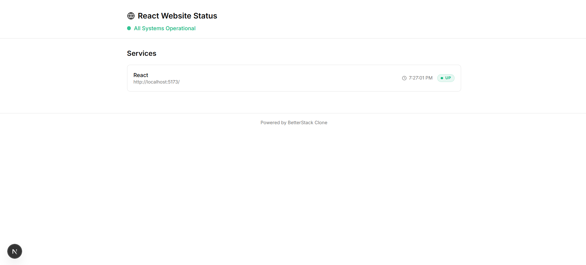
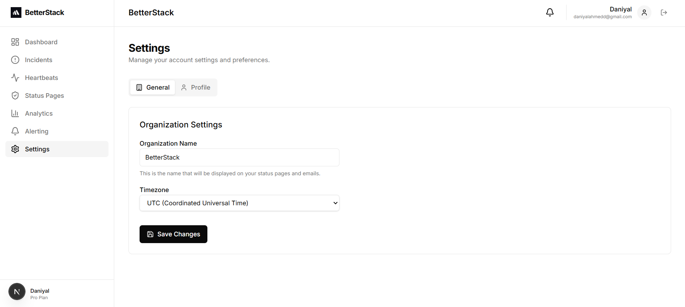

# BetterStack

A production-grade uptime monitoring solution built with modern web technologies.







## Overview

BetterStack Clone is a robust uptime monitoring platform that actively checks your websites and services from multiple regions. It provides real-time alerts, detailed incident management, and public status pages to keep your users informed.

Unlike passive monitoring tools, this system **actively pings** your endpoints, ensuring you know about downtime the moment it happens, even if your server is completely unresponsive.

##  Key Features

-   **Multi-Region Monitoring**: Run worker nodes in different geographic locations to verify uptime from a global perspective.
-   **Real-Time Dashboard**: Live updates of your monitors with search, filtering, and instant status feedback.
-   **Incident Management**: Automatic incident creation when downtime is detected, with tracking for start time, end time, and cause.
-   **Multi-Channel Alerting**: Get notified via Email, Slack, SMS, or Voice calls (configurable via escalation policies).
-   **Heartbeat Monitoring**: Monitor cron jobs, background workers, and scheduled tasks by listening for incoming heartbeats.
-   **Status Pages**: Create beautiful, public-facing status pages to communicate system health to your users.
-   **Team & Settings**: Manage your organization profile, team members, and notification preferences.

## Tech Stack

-   **Frontend**: [Next.js](https://nextjs.org/) (React), Tailwind CSS, Shadcn UI, TanStack Query.
-   **Backend**: [Express](https://expressjs.com/) (Node.js), [Prisma](https://www.prisma.io/) (ORM).
-   **Database**: [PostgreSQL](https://www.postgresql.org/) (Primary DB), [Redis](https://redis.io/) (Streams).
-   **Authentication**: [Better Auth](https://www.better-auth.com/).

## Architecture

The system is built on a distributed architecture to ensure reliability and scalability.

```
┌─────────────────────────────────────────────────────────────┐
│                     User Dashboard                          │
└────────────────────────┬────────────────────────────────────┘
                         │
                    ┌────▼────┐
                    │ API     │
                    │ Server  │
                    └────┬────┘
                         │
              ┌──────────▼────────┐
              │ Redis Job Queue   │
              └──────┬──────┬─────┘
                     │      │
         ┌───────────┘      └───────────┐
         │                              │
    ┌────▼─────────┐            ┌──────▼──────┐
    │ Worker       │            │ Worker      │
    │ (Region A)   │            │ (Region B)  │
    └────┬─────────┘            └──────┬──────┘
         │                             │
         │       ┌────────────┐        │
         └─────▶│   Target   │◀───────┘
                 │  Website   │
                 └──────┬─────┘
                        │
                 ┌──────▼──────────┐
                 │    PostgreSQL   │
                 │    Database     │
                 └──────┬──────────┘
                        │
              ┌─────────▼─────────┐
              │  Alert Service    │
              └────┬──────────┬───┘
                   │          │
            ┌──────▼┐    ┌────▼────┐
            │ Email │    │  Slack  │
            └───────┘    └─────────┘
```

### Core Components

1.  **API Server**: Handles user requests, manages resources (monitors, incidents, etc.), and schedules monitoring jobs.
2.  **Redis Queue**: Distributes monitoring tasks to worker nodes.
3.  **Uptime Workers**: Stateless workers that consume jobs from Redis, perform HTTP checks, and report results.
4.  **Consensus Engine**: Determines the true status of a website based on reports from multiple regions (prevents false positives).

## Getting Started

### Prerequisites

-   Node.js 18+
-   pnpm
-   PostgreSQL
-   Redis

### Installation

1.  **Clone the repository**:
    ```bash
    git clone https://github.com/yourusername/betterstack-clone.git
    cd betterstack-clone
    ```

2.  **Install dependencies**:
    ```bash
    pnpm install
    ```

3.  **Environment Setup**:
    -   Copy `.env.example` to `.env` in `apps/web`, `apps/api`, `apps/worker`, and `packages/databases`.
    -   Update the variables with your local configuration (DB URL, Redis URL, etc.).

4.  **Database Setup**:
    ```bash
    cd packages/databases
    pnpm prisma db push
    ```

5.  **Start Development Servers**:
    ```bash
    # Start all services (Frontend, API, Worker)
    pnpm run dev
    ```

    -   **Web**: http://localhost:3000
    -   **API**: http://localhost:3001
    -   **Prisma Studio**: http://localhost:5555

## Region-Based Monitoring

To simulate multi-region monitoring locally:

1.  Start the default worker: `pnpm run dev` in `apps/worker`.
2.  Start a second worker with a different region ID:
    ```bash
    REGION_ID=us-west-1 pnpm run dev
    ```

## Contributing

Contributions are welcome! Please feel free to submit a Pull Request.

## License

This project is licensed under the MIT License.
