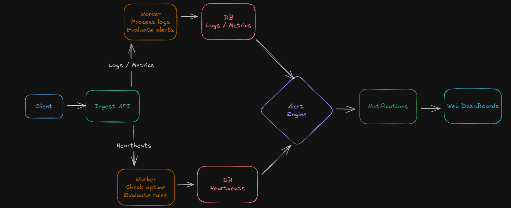

# BetterStack

How the Flow Works Together 

1. Client / Website / Service sends logs, metrics, heartbeats → API.

2. API validates and puts data into a queue.

3. Worker picks up the data:

4. Saves logs in DB

5. Checks metrics

6. Checks heartbeat timestamps

7. Creates alerts if something is wrong

8. Notifications are sent to users/admins.

9. Dashboard shows logs, metrics, uptime, and incidents.

## Day 1 Tasks
- Init Turborepo ✅
- Add Prisma
- Setup Postgres
- Create core tables
- Build log ingestion endpoint
- Testing

