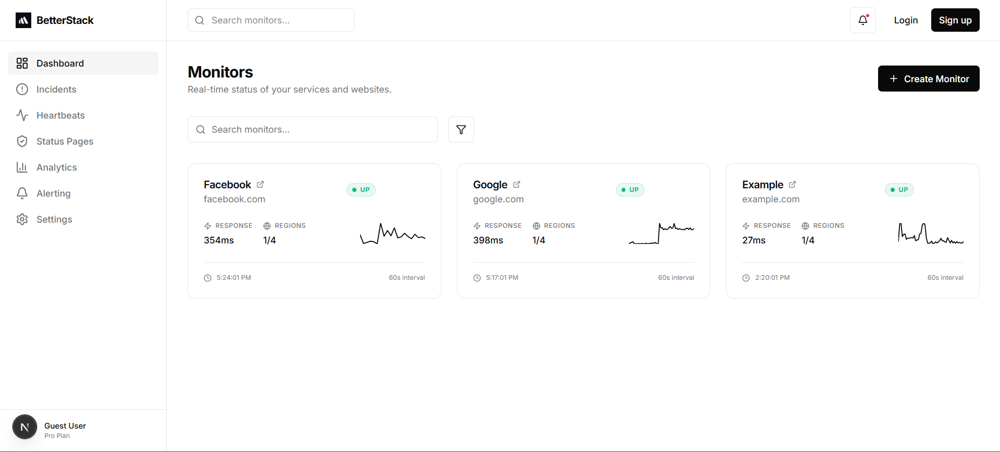

# Active Monitoring



* **actively pings websites**
* **does NOT rely on the user’s code**
* works even if their server is **completely dead**

User only gives:

* Website URL
* Check interval
* Alert rules

That’s it.

## 1️⃣ Core Components

```
User Dashboard
   ↓
API (Bun + Express)
   ↓
Redis (Jobs Queue)
   ↓
Uptime Workers (per region)
   ↓
Target Websites
   ↓
Postgres (results)
   ↓
Alerts
```

## 2️⃣ Step-by-Step Flow 

### Step 1: User adds a website

User enters:

* [https://example.com](https://example.com)
* Check every 60 seconds

API saves this in DB:

```
website
- id
- url
- interval
- enabled
```

### Step 2: Scheduler creates uptime jobs

Every X seconds:

* Scheduler finds websites that need checking
* Pushes jobs to Redis

Example Redis job:

```
{
  websiteId: "abc123",
  url: "https://example.com"
}
```

### Step 3: Workers pick jobs

Workers:

* Run forever
* Listen to Redis streams
* Pick jobs assigned to their region

Your code:

```ts
xReadGroup(REGION_ID, WORKER_ID)
```

This means:

> “Give me websites to check”


### Step 4: Worker checks website

Worker:

* Starts timer
* Calls `axios.get(url)`
* Waits for response or timeout

Results:

* Response → UP
* Error / timeout → DOWN


### Step 5: Store uptime result

Each check creates one row:

```
website_tick
- website_id
- region_id
- status (Up / Down)
- response_time_ms
- timestamp
```

This builds:

* History
* Graphs
* SLA
* Incidents


### Step 6: Incident detection 

You **don’t alert on first failure**.

Instead:

* Check last N ticks
* Example rule:

  * Down 3 times in a row → Incident

```
incident
- website_id
- started_at
- status (open / resolved)
```

---

### Step 7: Alert user

When incident starts:

* Send email
* Send Slack
* Send webhook

When recovered:

* Send recovery notification


## 3️⃣ Full Active Monitoring Diagram

```
┌──────────────┐
│   User UI    │
│  (Dashboard) │
└──────┬───────┘
       │
       ▼
┌────────────────────┐
│ API Server         │
│ (Bun + Express)    │
│ - Websites         │
│ - Alerts           │
└──────┬─────────────┘
       │
       ▼
┌────────────────────┐
│ Redis Streams      │
│ uptime_jobs        │
└──────┬─────────────┘
       │
       ▼
┌────────────────────────────┐
│ Uptime Worker              │
│ REGION = eu / us / asia    │
│                            │
│ axios.get(url)             │
└──────┬─────────────────────┘
       │
       ▼
┌────────────────────┐
│ Target Website     │
└──────┬─────────────┘
       │
       ▼
┌────────────────────┐
│ Postgres           │
│ website_tick       │
│ incident           │
└──────┬─────────────┘
       │
       ▼
┌────────────────────┐
│ Alert Service      │
│ Email / Slack      │
└────────────────────┘
```
